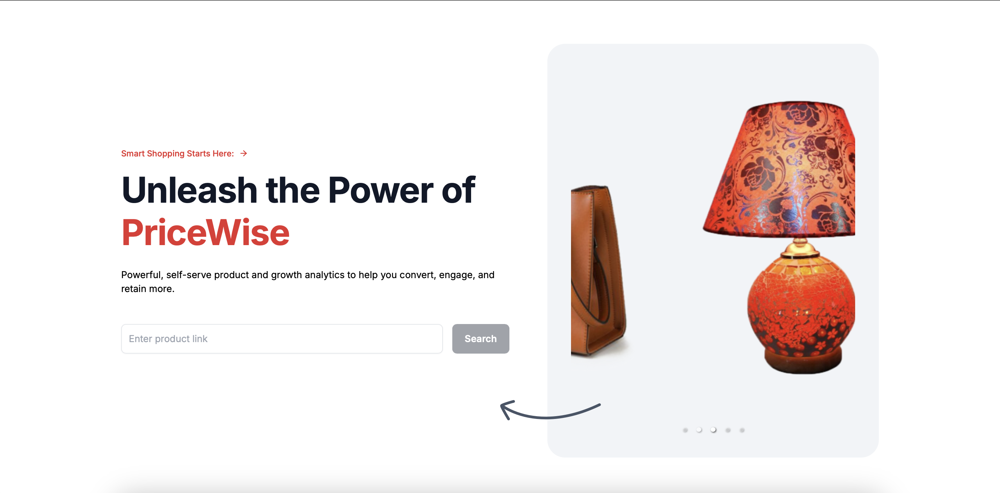
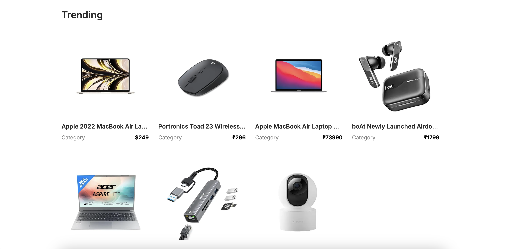
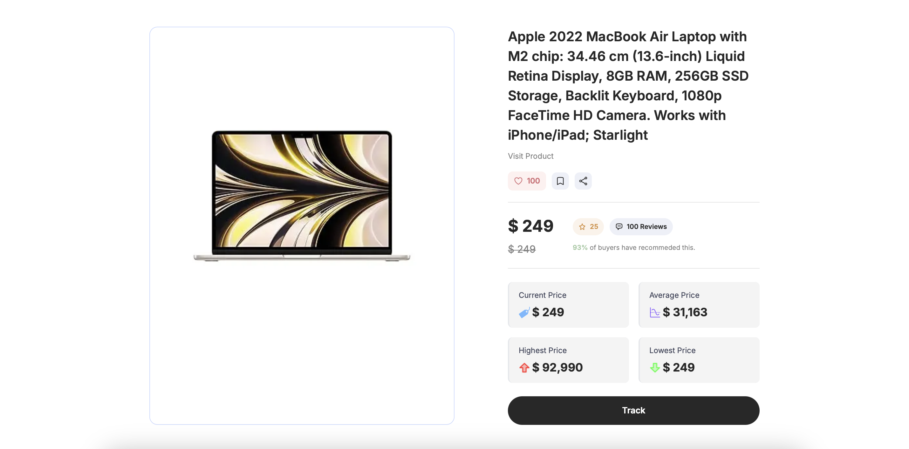
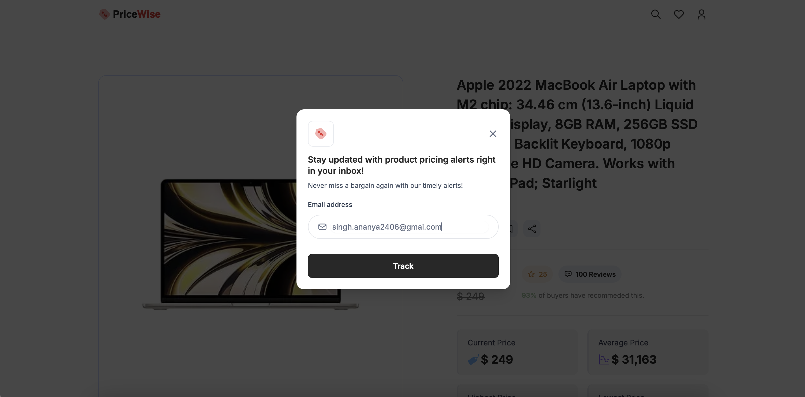

# Pricewise

**Pricewise** is a web application designed to assist users in tracking product prices and searching for products. It provides a streamlined user interface with components like a search bar, product cards, and price tracking functionality. Users can receive email notifications for price changes through an integrated email system. The application includes a cron job for daily price updates and utilizes web scraping to gather product details from online stores. With a focus on user experience, Pricewise offers a practical solution for savvy shoppers looking to stay informed about the best deals.

## 📦 Features

|     | Feature             | Description                                                                                                           |
| --- | ------------------- | --------------------------------------------------------------------------------------------------------------------- |
| ⚙️  | **Architecture**    | Built with Next.js, the app includes API endpoints for product search and cron jobs, with client-side components.     |
| 📄  | **Documentation**   | In-depth documentation for setup and usage instructions.                                                              |
| 🔗  | **Dependencies**    | Uses popular libraries like Next.js, React, Mongoose, nodemailer, and TailwindCSS for building a full-stack app.      |
| 🧩  | **Modularity**      | Code is fairly modular with separate directories for API, components, utilities, and models to handle distinct tasks. |
| ⚡️ | **Performance**     | Performance considerations include Next.js for optimized image loading and server-side rendering, incremental builds. |
| 🔐  | **Security**        | No explicit security features mentioned; relies on Next.js for secure defaults and Mongoose for data validation.      |
| 🔀  | **Version Control** | Git is implied for version control through the repository link; no specific strategies or tools are outlined.         |
| 🔌  | **Integrations**    | Email notification system and scraper indicate integration with email services and Amazon for product data.           |
| 📶  | **Scalability**     | Next.js framework supports scalability; no specific architectural patterns mentioned for handling significant growth. |

## ⚙️ Usage

- **Search Products**: Use the search bar to find products by name or category.
- **Track Prices**: Add products to track their price changes over time.
- **Email Notifications**: Receive email alerts for price drops.

## 🧩 Development

- **Next.js**: For server-side rendering and optimized performance.
- **Mongoose**: For MongoDB data management.
- **nodemailer**: For sending email notifications.
- **TailwindCSS**: For responsive UI components.

## 🔒 Security

- **Security Features**: Pricewise uses Next.js’s secure defaults and Mongoose for data validation. No explicit security features have been implemented beyond these standards.
- **Best Practices**: Follow common security practices for web applications, such as validating inputs, protecting against CSRF, and keeping your dependencies up to date.

## 🚀 Deployment

Pricewise is deployed on Vercel. To view the deployed app, visit the following URL:

- [Pricewise Deployed App](https://pricewise-omega-peach.vercel.app/)

## 👥 Contributing

Feel free to contribute to Pricewise by forking the repository and submitting pull requests. Follow the existing coding style and practices in your contributions. Any contributions will be reviewed and tested before merging.
